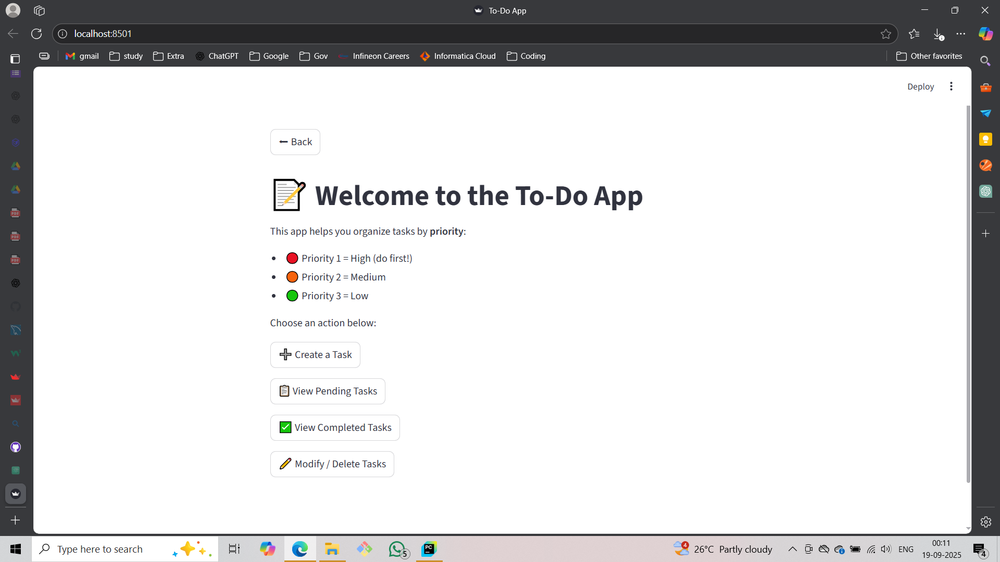
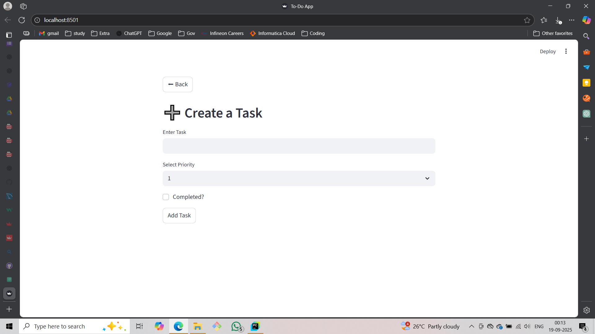
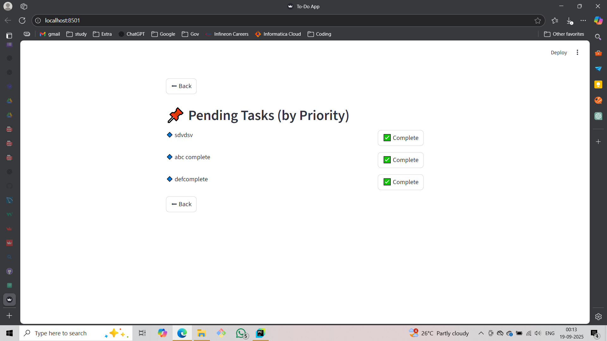

# 📝 To-Do Web Application

A **streamlined, priority-based To-Do web app** built using **Python**, **Streamlit**, and **MySQL**. Organize your tasks by priority, mark them completed, and modify or delete them with ease.

---

## 🎯 Features

* **Priority-based Task Management**:

  * 🔴 Priority 1 – High
  * 🟠 Priority 2 – Medium
  * 🟢 Priority 3 – Low

* **Task Actions**:

  * ➕ Create a new task
  * 📋 View pending tasks (sorted by priority)
  * ✅ View completed tasks
  * ✏️ Modify or delete tasks

* **Single-page Streamlit app** with smooth navigation and dynamic UI.

* **User-friendly UX**: Completed tasks are immediately removed from pending tasks, and updates/deletions redirect to the welcome page.

---

## 🛠 Technology Stack

| Layer    | Technology                                                     |
| -------- | -------------------------------------------------------------- |
| Backend  | Python + MySQL                                                 |
| Frontend | Streamlit                                                      |
| Database | MySQL (with columns: `id`, `Task`, `Priority_ID`, `Completed`) |

---

## ⚙️ Setup Instructions

1. **Clone the repository**

```bash
git clone https://github.com/23Muniraja/To_Do-GPT.git
cd To_Do-GPT
```

2. **Install dependencies**

```bash
pip install -r requirements.txt
```

3. **Create the database**

```sql
CREATE DATABASE IF NOT EXISTS db_to_do_gpt;
USE db_to_do_gpt;

CREATE TABLE IF NOT EXISTS To_Do (
    id INT AUTO_INCREMENT PRIMARY KEY,
    Task VARCHAR(255) NOT NULL,
    Priority_ID INT NOT NULL,
    Completed TINYINT(1) NOT NULL DEFAULT 0
);
```

4. **Run the Streamlit app**

```bash
streamlit run app.py
```

5. **Navigate the app**: Welcome page → select Create / View / Modify tasks

---

## 📝 How It Works

1. **Create Task**: Enter task description, select priority, optionally mark as completed.
2. **View Pending Tasks**: Tasks are sorted by priority (1 → 3) and order of insertion.
3. **View Completed Tasks**: Displays all tasks marked as completed.
4. **Modify/Delete Task**: Select a task, edit its details or delete it. After action, the app redirects to the Welcome page.

---

## ⚡ Issues & Solutions

| Issue                                                       | Solution                                                                             |
| ----------------------------------------------------------- | ------------------------------------------------------------------------------------ |
| Duplicate Streamlit element IDs when using multiple buttons | Assigned **unique `key` parameters** for all buttons to prevent conflicts.           |
| `'str' and 'int'` type errors from MySQL tuples             | Ensured **type conversion**: `Priority_ID` → int, `Completed` → int/bool.            |
| Streamlit page not redirecting after update/delete          | Used **`st.session_state.page` + `st.stop()`** to force page reload to Welcome page. |
| Selectbox index out of range                                | Clamped priority index using `max(0, min(priority_id-1, 2))` to ensure valid index.  |

> These issues were resolved iteratively with assistance from **GPT**, allowing smooth UX and robust task handling.

---

## 📌 Future Improvements

* Add **user authentication** to maintain separate task lists.
* Add **due dates and reminders**.
* Add **drag-and-drop UI** for task reordering.
* Deploy the app to **Streamlit Cloud** or **Heroku**.

---

## 🎨 Screenshots






---

## 💻 Author

**Muniraja M** – Full Stack / Data Science enthusiast
[GitHub](https://github.com/23Muniraja) | [LinkedIn](https://www.linkedin.com/in/23-muniraja-m/)
